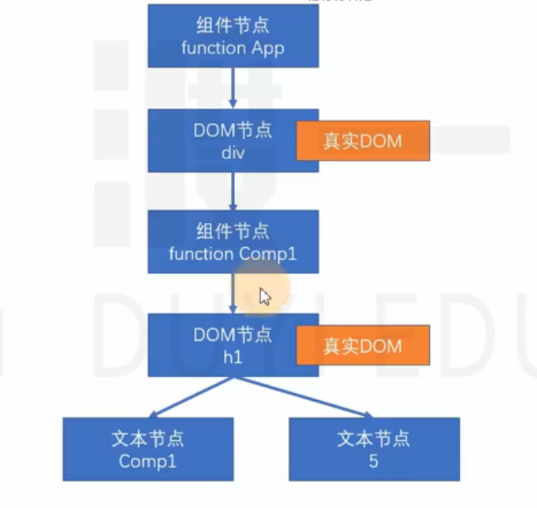
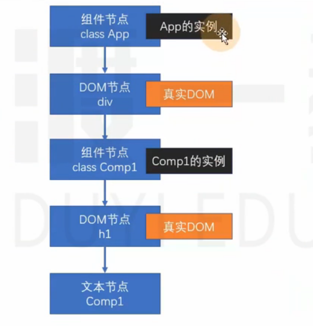

## react渲染原理(面试常考!!!)

新节点挂载篇

React元素定义:React Element , 通过React.createElement创建(语法糖:JSX)

例如:<div><h1>标题</h1></div>
也可以是组件
例如:<App />

那么元素是怎么渲染到页面上的,
先会把React元素转化为React节点

React节点:专门用于渲染到UI界面的对象,React会通过React元素,创建React节点
ReactDOM一定是通过React节点来进行渲染的

节点类型:
React DOM节点:创建该节点的React元素类型是一个字符串
React 组件节点:创建该节点的React元素类型是一个函数或是一个类
React 文本节点:有字符串创建
React 空节点:由null,undefined,false,true
React 数组节点:该节点由一个数组创建
真实DOM:通过document.createElement创建的dom元素

React元素渲染到浏览器大概流程
React元素                 =>               React节点            =>                 用户UI界面
ReactDom.createElement()

## 首次渲染(新节点渲染)(就是新版生命周期的顺序!!!)
constructor() => 
static getDerivedStateFromProps() => 
render() 将return中的React元素节点全部转化为虚拟DOM树 =>
componentDidMount() => 这个时候虚拟dom全部都变成真实DOM渲染到了root(页面html)中

componentDidMount执行栈(一个数组)中push一个console.log("b"),等App中的render全部执行完毕之后(也就是虚拟DOM渲染完毕了)之后会在componentDidMount执行栈(一个数组)中push一个console.log("a")

1.通过参数的值创建节点
2.根据不同的节点,做不同的事情(注意:目前只能渲染这五种类型,写其他类型会报错,比如{[0,"asdfb",<p>asfddd</p>]}是数组类型可以渲染,但是:{{name:"江浩",age:18}}对象则不行,数组节点可以渲染,对象节点无法构建虚拟DOM树会报错)
    1.文本节点:通过document.createTextNode创建真实的文本节点
    2.空节点:什么都不做
    3.数组节点:遍历数组,将数组每一项递归创建节点(回到第一步进行反复操作,直到遍历结束)
    4.DOM节点:通过document.createElement创建真实DOM对象,然后立即设置该真实DOM元素的各种属性,然后遍历对应React元素的children属性,递归操作(回到第一步进行反复操作知道遍历完成)
    5.组件节点:
        1.函数组件:调用函数(该函数必须返回一个可以生成节点的内容),将该函数的返回结果递归生成节点,直到遍历结束
        2.类组件
            1.通过new 得到实例对象(new的过程就是会马上执行一遍constructor)
            2.调用静态方法 static getDerivedStateFromProps()
            3.运行该对象的render()方法,拿到节点对象(将该节点递归操作,回到第1步进行反复递归操作)
            4.将该组件的componentDidMount生命周期函数加入到执行队列中,当整个虚拟DOM树全部构建完毕,并且将真实的DOM对象加入到容器中后,执行该队列
3.生产虚拟DOM树之后,将该树保存起来,以便后续使用
4.将之前生成的真实DOM对象(app),(将app)加入到容器中

彩蛋:看控制台的输入,想想为什么是1 2 3 4 5 6 1 2 3 4 5 6 b a b a!!! =>例子见App1.js
```js
// 普通节点类型
const root = ReactDOM.createRoot(document.getElementById("root"))
const app = <div>
    <h1>标题{["abc",null,<p>段落</p>]}</h1>
    <p>{undefined}</p>
</div>
root.render(app)
```

以上代码生成的虚拟DOM树


```js

function App(props){
    return <div>
        <Com n={5}/>
    </div>
}
function Com(props){
    return <h1>
        Com {props.n}
    </h1>
}
// 函数组件类型
const root = ReactDOM.createRoot(document.getElementById("root"))
const app = <App/>
root.render(app)
```

以上代码生成的虚拟DOM树


```js
class App extends React.Component{
    render(){
        return <div>
            <Com />
        </div>
    }
}
class Com extends React.Component{
    render(){
        return <div>
            <h1>Com</h1>
        </div>
    }
}
// 类组件类型
const root = ReactDOM.createRoot(document.getElementById("root"))
const app = <App/>
root.render(app)
```

以上代码生成的虚拟DOM树



## 更新

1.调用ReactDom.createElement().render()渲染,重新生成节点树
    1.触发根节点(<App/>)重新渲染
2.在类组件中调用this.setState()
    1.触发类组件的重新渲染(this指向组件的重新渲染)

**节点更新**

- 如果调用的是ReactDOM.render,进入根节点对比(diff)更新
- 如果调用的是setState
    - 1.运行生命周期函数,static getDerivedStateFromProps
    - 2.运行shouldComponentUpdate,如果该函数返回false,终止当前流程
    - 3.运行render,得到一个新的节点,进入该新的节点的**对比更新**
    - 4.将生命周期函数getSnapshotBeforeUpdate加入执行队列,以待将来执行
    - 5.将生命周期函数componentDidUpdate加入执行队列,以待将来执行(有点像vue的发布订阅模式)

后续步骤:
1.更新虚拟DOM树
2.完成真实DOM更新(所以在126行到130行中(1-5)获取DOM是旧的)
3.依次调用执行队列里的componentDidMount(有些时候会触发)
4.依次调用执行队列里的getSnapshotBeforeUpdate
5.依次调用执行队列里的componentDidUpdate
6.依次调用执行队列里的componentWillUnmount(该卸载的时候)

**对比更新**

将新产生的节点和之前虚拟DOM树中的节点比对,发现差异,完成更新

问题:对比之前DOM树中那个节点

React为了提高对比效率,做出以下假设(就是if判断,99%概率都是走的true)

1.假设节点不会出现层次的移动(对比时,直接找到旧的虚拟DOM树结构中对应深度位置的节点进行对比)
2.不同的节点类型会生成不同的结构
    1.相同的节点类型:节点本身类型相同,如果是组件节点,组件类型也必须相同
3.多个兄弟通过唯一标识(key)来确定对比的新节点

key值的作用:用于通过旧节点,寻找对应的新节点,如果某个旧节点有key值,则其更新时,会寻找相同层级中拥有相同key值的节点

## 找到了对比的目标

判断节点类型是否一致


- **一致**

根据不同的节点类型,做不同的事情

**空节点**:不做任何事情

**DOM节点**:
1.直接重用之前的真实DOM对象
2.将其属性的变化记录下来,以待将来统一完成更新(现在不会真正变化)
3.遍历该新的React元素的子元素,**递归对比更新**


**文本节点**:
1.直接重用之前的真实DOM对象
2.将新的文本变化记录下来,将来统一完成更新

**组件节点**(分一下两种情况):

**1.函数组件**:重新调用函数,得到一个节点对象,进入递归对比更新

**2.类组件**:(这个面试有的时候会考)
1.重用之前的实例
2.调用生命周期方法getDerivedStateFromProps
3.调用生命周期方法shouldComponentUpdate,若该方法返回false,流程终止
4.运行render,得到新的节点对象,进入**递归对比更新**
5.将该对象getSnapshotBeforeUpdate加入队列
6.将该对象的componentDidUpdate加入队列

**数组节点**:遍历数组进行**递归对比更新**

- **不一致**

整体上,卸载旧的节点,全新创建新的节点

**创建新节点**

进入新节点的挂载流程

**卸载旧的节点**

1. **文字节点/DOM节点/数组节点/空节点/函数组件节点**:直接放弃该节点,如果节点有子节点,递归卸载子节点
2. **类组件节点**

    1.直接放弃该节点
    2.调用该节点的componentWillUnmount函数
    3.递归卸载子节点(注意,不是删除真实DOM,删除真实DOM在后续步骤,先重新绘制虚拟DOM树,然后删真实DOM)


## 没有找到对比的目标


灵魂拷问:在react中如何实现vue中的v-if判断选择性展示元素内容
````js
return (
    <div>
        {this.state.visbile?(<p>p1</p>):(<p>p2</p>)}
    </div>
) 
``

1.考点一:画出一个<App/>组件对应的虚拟DOM树结构
2.考点二:App1.js的执行顺序为什么先输出b,在输出a,因为App中Render阶段的时候渲染ComA组件,渲染完了后会在
3.考点三:App1.js如果写两个<App/> 那么输出顺序是什么?
4.为什么{[1,2,<p>我是猪</p>]}能构建,但是{{name:"123",age:50}}渲染不了
5.为什么React要绘制虚拟DOM树?
答:在render之后形成新的虚拟dom树后要对比新旧虚拟dom树差异做出更新,其实就是在递归对比虚拟DOM树的元素寻找差异,vue是比对的vnode(把template转化成vNode)!也就是虚拟DOM
6.App2.js 为什么能58行获取不到B的dom,打印的是null,点击按钮,视图是ComB b:kfc但是打印的却为什么是ComB b:abc?
答:这里其实获取不到dom这个时候B组件的生命周期才走到render,render是要生成虚拟dom树的,走完render之后到componentDidMount()的时候才能获取真实dom,后面点击也是同理获取的是旧的虚拟dom,真实的dom还没有更新过去呢
7.react中数组成员为什么要加key?
举个例子,一个数组长度1000,在前面添加一个成员,如果不加key的话,react在对比更新阶段要操作1001次,如果加key的话只需一次就够了,可以参考app5.js


朋友，小戒靠忍，大戒靠悟。多去接触接触佛法，了解色欲的本质真相。其实欲望来的时候就是你身体周围啖精气鬼在影响你，刺激你的下体，让你有想淫欲的心，并不是你自己本性想这样，你想想你每次破戒以后是不是没有那种想淫欲的感觉了，整个人也清醒了，也想做个好人了，这就是因为破戒以后他们吃饱了，不影响你了，你恢复了自性中的你。不管男女下体是很肮脏恶臭的地方，你想想为什么我们欲望来的时候会对这个东西感兴趣，就是你被周围的看不见的一些低贱的阴间灵体所影响，因为他们喜欢，所以迷惑你的念头让你喜欢，让你破戒去供他们吃饱。我们被鬼和兽给控制主宰了。我们把这些鬼的欢喜当成了自己的欢喜，把鬼的念头当成自己的念头，把鬼当作了自己。一个正常的人，怎么会对男女的下体感兴趣？怎么会对一块臭烘烘、肮脏的肉无比激动和兴奋呢？所以明白了本质，看清了真相就悟出了道理，下次再想破戒的时候就想想他们又想吃饭了，他们又在周围刺激你的下体，让你有性欲，让你破戒，所以你去破戒有什么意义呢？一次次破戒害了自己身体，害了自己的运气，最后一事无成。性欲强并且经常破戒的人身体周围这种鬼就越多，因为它们知道你这能经常提供精血食物，周围越多对你的影响就越大，就越想破戒，总想破戒。努力戒一段时间，这样低下的阴间灵体知道从你这获取不到食物精气，时间久了就不会缠着你了，慢慢就成功了。多念阿弥陀佛和观世音菩萨对戒色有很大帮助，功德不可思议。希望上述所讲可以帮助到你。如果它能帮助到你，也请你转发给别人，希望能帮助更多的人。


