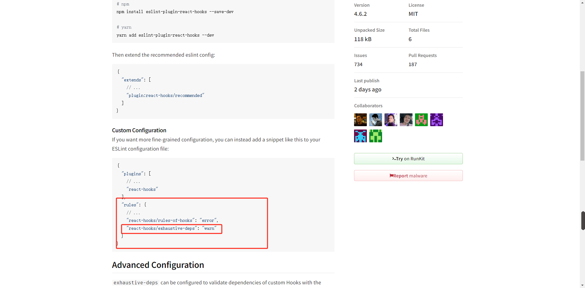

# 自定义hook

State Hook:  useState
Effect Hook: useEffect

自定义Hook: 将一些常用的,跨越多个组件的hook功能,抽离出去形成一个函数,该函数就是自定义Hook,自定义hook,由于其内部需要使用hook功能,所以它本身也需要按照Hook的规则实现:

1.函数名必须以use开头
2.调用自定义Hook函数时,应该放到顶层

例如:

1.很多组件都需要在第一次加载完成后,获取所有学生数据

自定义Hook和高阶组件对比:
高阶组件会让层级变的复杂,排查问题慢,
同时ref也难获取,得要ref转发
而且没有自定义hook写起来简单

vscode更新后变成英文怎么办?
按f1 输入config 选择Configure Display Language
选ch-cn即可

使用Hook的时候,如果没有严格按照Hook的规则进行,eslint的一个插件
(eslint-plugin-react-hooks)会报出警告

/* eslint "react-hooks/exhaustive-deps": "off" */
// 单文件中删除eslint中eslint-plugin-react-hooks插件报的警告
