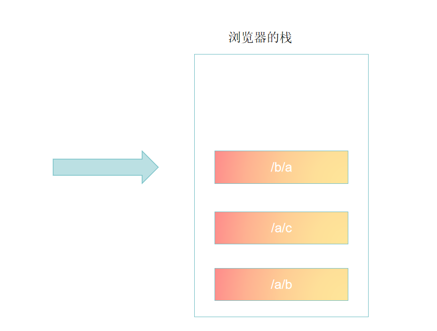

# React 路由

1.根据不同的页面地址,展示不同的组件(核心)
2.完成无刷新的页面切换

我们把实现这两个功能的插件,称之为路由

## React Router

1.react-router:路由核心库,包含诸多和路由功能相关的核心代码
2.react-router-dom:利用路由核心库,结合实际的页面,实现跟页面路由密切相关的功能

如果是在页面中实现路由,需要安装react-router-dom库

url地址组成
https://www.react.com/news/1-2-1.html?a=1&b=2#login-user
1.协议名(schema):https和http
2.主机名(host):www.react.com
    1.ip地址
    2.预设值:localhost
    3.域名
    4.局域网中电脑名称
3.端口号(prot):
    https:默认端口号443,默认端口号可以省略
    http:默认端口号80,默认端口号可以省略
4.路径(path):/news/1-2-1.html(域名+端口号后面的叫path)比如:www.baidu.com/中www.baidu.com是域名 / 是路径,叫根路径
5.地址参数(search,query):?a=1&b=2
6.路由方式(哈希(hash\锚点))
    1.附带的数据
    其实#后面的值也可以获取,
    console.log(location.hash)就是
## Hash Router 哈希路由

#(读音:啥破,不是读井,啥破是声乐里的读法,#意思是声调,比如c#不读c井)方式切换
原因#abc => #bdc hash值的变化不会使页面刷新

根据hash值(#后面的值)来判断显示哪些组件
优点:兼容性好,浏览器版本低的时候兼容hash,不会兼容history

## Borswer History Router 浏览器历史记录路由 

HTML5出现后,新增了History API ,从此以后,浏览器拥有改变路径而不刷新路径而不刷新页面的方式

History表示浏览器的历史记录,它使用栈的方式储存

浏览器的栈获取方式:
window.history
window.history.length = 浏览器栈的长度

history方法
就是指针移动
history.go(-1) 指针向后移动一格
history.back() 指针向后移动一格
history.forward() 指针向前移动一格
新的history的api
history.pushState:向当前栈中加入一条新的栈,不会导致页面刷新
    第一个:任意数据,自定义的类型,可以是任何类型(打印history能访问到),
    第二个:页面标题,大部分浏览器不支持,没用,一般传null
    第三:新的地址"改变的路径地址"
    history.pushState("附加的数据",null,"a/b/c")

history.replaceState:将当前指针指向的历史记录,替换为某个记录
    第一个:任意数据,自定义的类型,可以是任何类型(打印history能访问到),
    第二个:页面标题,大部分浏览器不支持,没用,一般传null
    第三:新的地址"改变的路径地址"
    history.replaceState("替换的数据",null,"a/b/d") 也就是说 上一次的数据("附加的数据",null,"a/b/c")被覆盖了,有点类似于重定向,之前的地址因为被覆盖了,所以访问不到了,只能访问replaceState替换掉的数据

根据路径的值(端口号后面的:/news/1-2-1.html)渲染哪些组件(项目常用路由方式)

## 路由组件

React-Router 为我们提供了两个重要组件

## Router组件

它本身不做任何展示,仅提供路由模式配置,另外,该组件会产生一个上下文,上下文中会提供一些实用的对象和方法,供其他相关组件使用

1.HashRouter:该组件,使用hash模式匹配
2.BrowserRouter:该组件,使用BrowserHistory模式匹配

通常情况下,Router组件只有一个,将该组件包裹整个页面

## Route组件

1.path:匹配的路径地址
    1.默认情况下不区分大小写,可以设置sensitive,默认为true,路径是否对应大小写
    2.默认情况下,会匹配所有目录
        比如:路径中输入/a/b会同时出现path="/a"和path="/a/b"的组件
        <Route path="/a" exact component={A} >
            <h1>你将会看到我,path没有匹配到我</h1>
        </Route>
    如果要精确匹配exact属性,默认为true
    3.如果不写patch的话,默认显示该组件
2.component:对应的组件
3.children:
    1.传递React元素,无论是否匹配,一定会显示children,并且会忽略component属性
    2.传递一个函数,该函数有多个参数,这些参数来自于上下文,该函数返回react元素,则一定会显示返回的元素,
    并且忽略component属性

switch组件:只会显示匹配到的第一个Route组件,
只能包含Route组件
例如
<Switch>
    <Route path="/a" exact component={A} />
    <Route path="/a/b" exact component={B} />
    <Route path="/a/c" exact component={C} />
    <Route component={fourPage} /><!-- 404页面 -->
</Switch>
路径是/a/b/c因为找不到,所以会返回最后一个404页面

