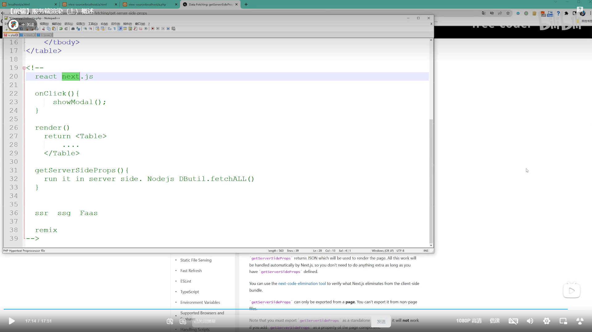

# React 服务端渲染 ssr ssg

- 服务端渲染 ssr 
依靠next.js(后端框架)运行的

在react class组件中
{
    render(){
        return <>
    }
    getServerSideProps(){
        //服务端渲染的next.js 语法代码
        //fetch("1.json")
        获取json文件代码
        forEach(){}得到想要的业务代码
    }
}

在react中写getSeverSideProps方法的时候函数体是在服务端severSide运行的,返回请求的对象
然后注入到组件中的props属性中就可以实现服务端渲染

ssg 就是把一些服务端代码打包到cdn链接中引入cdn就能得到渲染的服务端渲染的代码

## react 源码小结

研究源码的话首先要调试源码

const root = ReactDOM.createRoot(document.getElementById("root"))
root.render(<App />)

首先要研究的就是jsx怎么转化成React元素的?
在react中用的是jsx语法描述dom结构的,执行react项目的过程中jsx语法会被babel转化成调用createElement方法,调用这个函数会return ReactElement()这个方法会返回React元素 其实就是返回一个js对象,也就是用来描述真实dom

React 16. 设计架构
1.Scheduler(调度层):调度任务的优先级,高优先级任务优先进入协调器
在React15版本中采用了循环递归virtualDOM(虚拟DOM)的比对,由于递归用的是js自身的执行栈,一旦开始就无法停止,知道执行完成,如果virtualDOM层级非常深的话就会长期占用js主线程,由于js是单线程无法同时执行其他任务,所以这时候会造成无法响应用户操作,无法及时执行元素动画,造成页面卡顿
在react16中放弃了循环递归virtualDOM,而是采用循环模拟递归,而且比对过程是利用浏览器空余时间完成的,不会长期占用主线程,这就解决了virtualDOM比对造成页面卡顿的问题.
总体:他要保证任务调度,负责React代码在浏览器空闲时间执行

2.Reconciler(协调层):构建Fiber数据结构,比对Fiber对象找出差异,记录Fiber对象要进行的DOM操作
负责构建Fiber节点,找出Fiber节点差异,并标记差异

3.Renderer(渲染层):负责将发生变化的部分渲染到页面
根据Fiber节点执行渲染操作

Fiber数据结构
其实就是js对象,从virtualDOM演变而来的

return 

    <h1>name</h1>
    <App />

比如这个组件会被渲染成三个Fiber数据,以及形成对应的Fiber树结构

双缓存技术
在内存中构建,构建完成后将自动替换的技术叫双缓存技术
React使用双缓存技术完成Fiber树的构建与替换,实现DOM对象的快速更新
在React中最多同时存在两课Fiber树,当前在屏幕中显示的内容对应的Fiber树叫做currentFiber树,当发生更新时,React会在内存中重新构建一颗新的Fiber树,这颗正在构建的Fiber树叫做workInProgress树,这棵树就是即将要显示到内存中的Fiber树,当这颗Fiber树构建完成后,React会使用它直接替换currentFiber树达到快速更新DOM的目的.因为workInProgressFiber树是在内存中构建的所以他的构建速度非常快的.
一旦workInProgressFiber树在屏幕中构建完成,它就会替换旧的树变成currentFiber树

区分fiberRoot和rootFiber

fiberRoot 表示Fiber数据结构对象,是Fiber数据结构外层的对象
rootFiber 表示组件挂载点对应的Fiber对象,就是id为root的div对应的Fiber对象就是rootFiber

fiberRoot包含rootFiber,在rootFiber中current.stateNode:FiberRoot
而fiberRoot只能有一个,而rootFiber可以有多个因为render方法是可以调用多次的,而render调用的时候第二个参数就是rootFiber
fiberRoot会记录应用更新的信息,比如协调层在完成工作后,会将工作成果储存在fiberRoot中

## React初始化

初始化阶段和更新阶段都在这里进行
    判断container上面有没有创建fiberRoot和rootFiber,如果有的话就是更新阶段,如果没有的话就是初始化阶段
初次进入肯定是初始化阶段
1.调用render方法去创建new FiberRoot()对象以及rootFiber()并且相互之间建立关系
2.然后会创建一个任务队列,在任务队列中放初始化渲染页面的任务,再把任务队列添加到浏览器的任务队列里
等浏览器有空闲的时间再去执行!
3.浏览器开始执行放到任务队列里的初始化任务
为FiberRoot中每个react元素添加Fiber对象形成对应的Fiber树(就是FiberRoot)
此时构建的Fiber树其实就是workInProgressFiber树以及要构建对应的rootFiber
然后循环

进入初始化阶段后创建FiberRoot和RootFiber,并且两者建立联系
